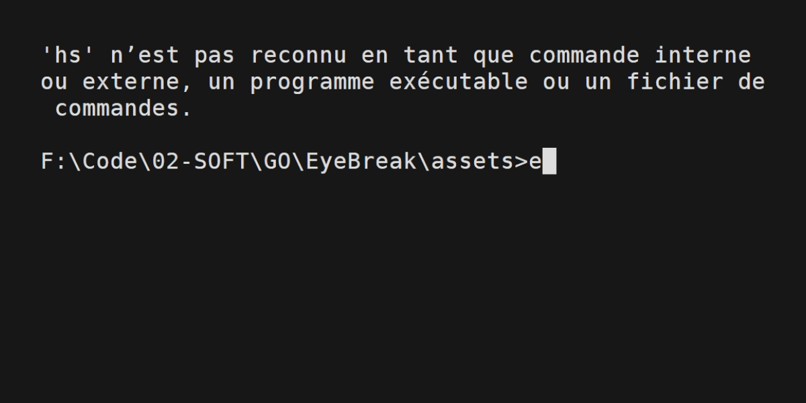

# eyebreak



<p align="center">A simple CLI utility to take break according to the 20-20-20 rule. </br>(every 20 minutes a person looks at a screen, they should look at something 20 feet away for 20 seconds).</p>

## Installation

```bash
git clone https://github.com/Koalhack/eyebreak.git
```

## Build

> Require to install Go

Enter in the `eyebreak` folder and run the followings command :

```bash
go build
```

```bash
go install
```

## Usage

Now you can use `eyebreak` program everywhere in your terminal.

Just run the following command:

```bash
eyebreak
```

### Help

You can add help command for help and useful information

```bash
eyebreak help
```

## Dependencies

- [BubbleTea](https://github.com/charmbracelet/bubbletea)
- [Bulble](https://github.com/charmbracelet/bubbles)
- [LipGloss](https://github.com/charmbracelet/lipgloss)
- [Cobra](https://github.com/spf13/cobra)
- [Beeep](https://github.com/gen2brain/beeep)
